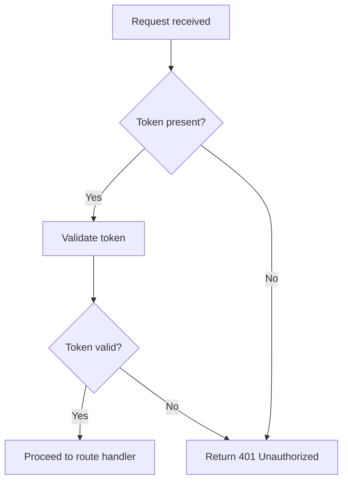
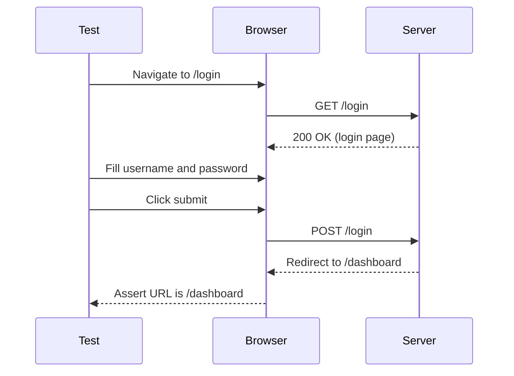

# Mermaid

Take a codebase and any associated tests and document them through appropriate diagrams using Mermaid.

## Audience

This skill is designed for **beginner software developers** who want to visualize their codebase structure, workflows, or test flows without needing deep knowledge of diagramming tools.

## Trigger

This skill should be activated when the user:

- Mentions **documentation** for their codebase or tests
- Asks for **diagrams** or references **Mermaid**
- Requests visualization of a specific file, workflow, process, or sector

## Inputs

The user may provide any of the following:

- Specific file names
- Workflows
- Processes
- Sectors or areas of the codebase

## Outputs

- One or more **Mermaid markdown diagrams** that accurately represent the requested content
- Diagrams should be scoped to the provided input and rendered as fenced Mermaid code blocks

## Must Do

- Accurately and sensibly depict the requested content via a Mermaid diagram
- Only diagram code, logic, and flows that are explicitly present in the provided codebase or files — never invent or assume
- Treat test flows with the same level of accuracy and care as production code flows
- Choose the most appropriate Mermaid diagram type for the content (e.g., flowchart, sequence, class, state)

## Must Not Do

- Create overly large or complex diagrams that have significant visual overlap
- Hallucinate code paths, functions, or relationships that do not exist in the provided input
- Produce diagrams that are misleading or inaccurate representations of the codebase

## Examples

### Example 1: Documenting a file's function flow

**User prompt**: "Can you create a Mermaid diagram for the `auth.js` file?"

**Output**:

---

### Example 2: Documenting a test flow

**User prompt**: "Show me a diagram of the login test flow."

**Output**:

