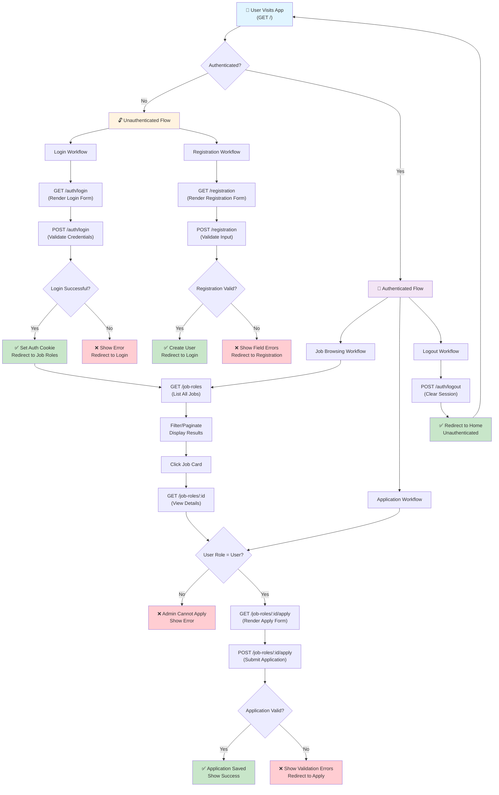

# Frontend Application Workflows

This diagram shows the main user workflows in the team1-frontend application. Use this as a reference when selecting workflows to test with the Playwright testing framework.

## Key Workflows for Playwright Testing

### 1. **Authentication Flows**
- **Login**: Render form → Submit credentials → Validate → Redirect (success/error)
- **Registration**: Render form → Submit data → Validate → Create user → Redirect (success/error)
- **Logout**: Clear session → Redirect to home

### 2. **Job Browsing Flows**
- **List Jobs**: View all available job roles with pagination/filtering
- **View Details**: Click on a job to see full details (title, description, salary, etc.)

### 3. **Application Flow**
- **Apply for Job**: 
  - User (role check) → Render apply form
  - Submit application with validation
  - Success/error handling and redirect

### 4. **Authorization Checks**
- **Admin vs User**: Different access levels (Admins can't apply, Users can't access admin features)
- **Authenticated vs Unauthenticated**: Different routes available

## Middleware & Validation Points
- `validateBody()` - Validates request payloads against schemas
- `authoriseRoles()` - Checks user role for route access
- `validateJobRoleId` - Validates job role ID parameter
- `setErrorRedirect()` - Handles error redirects with context
- `userInfo` - Loads user info from auth cookies

## Test Coverage Recommendations

| Workflow | Test Type | Priority |
|----------|-----------|----------|
| Login (success) | E2E | High |
| Login (invalid credentials) | E2E | High |
| Registration (success) | E2E | High |
| Registration (validation errors) | E2E | High |
| Logout | E2E | Medium |
| View job list | E2E | High |
| View job details | E2E | High |
| Apply for job (success) | E2E | High |
| Apply for job (validation errors) | E2E | Medium |
| Authorization: Admin cannot apply | E2E | Medium |
| Authorization: Unauthenticated cannot access jobs | E2E | Medium |
