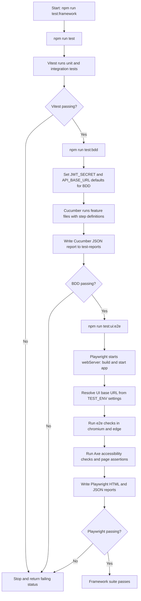
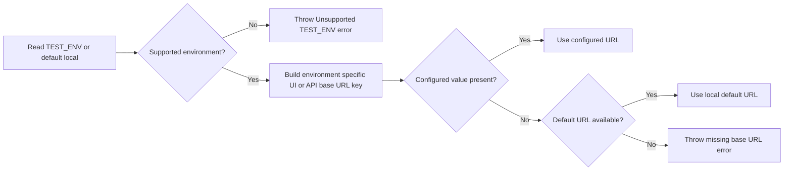
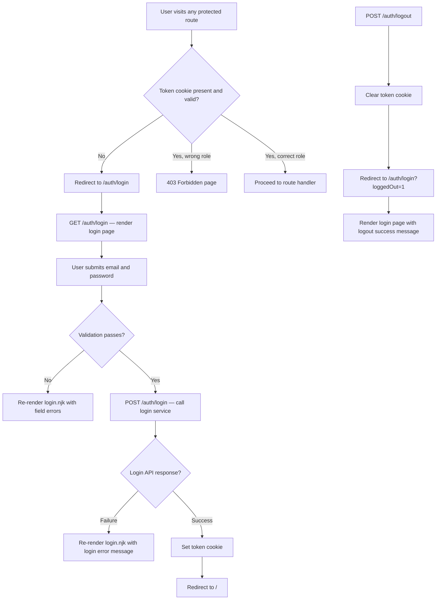
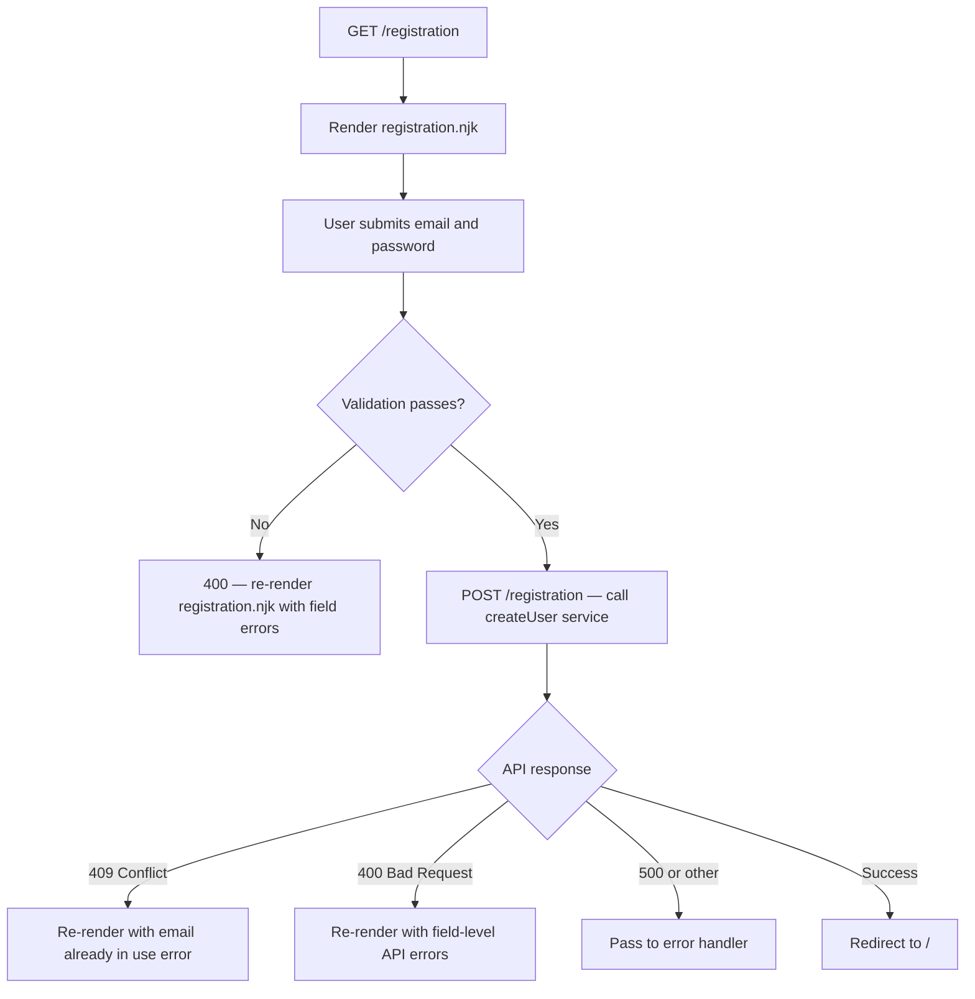
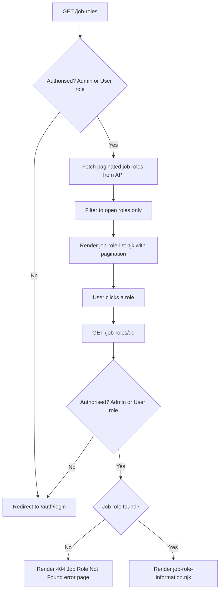
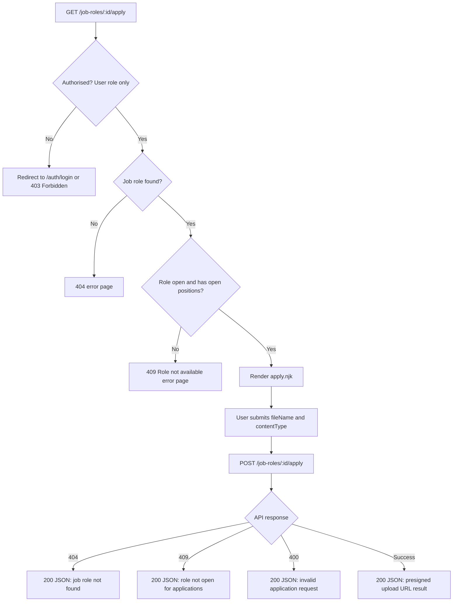

# Testing Workflows

This file documents the current automated testing workflows configured in this repository.

## End-to-end Framework Test Workflow

## Test Environment URL Resolution Workflow

## Frontend Application Workflows

These diagrams describe the user-facing workflows in the application. Use them to identify flows to cover with Playwright e2e tests.

### Authentication Workflow

### Registration Workflow

### Job Roles Workflow

### Application Workflow

