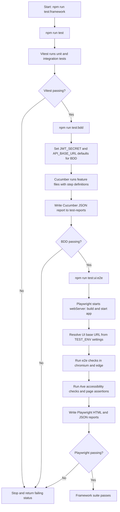
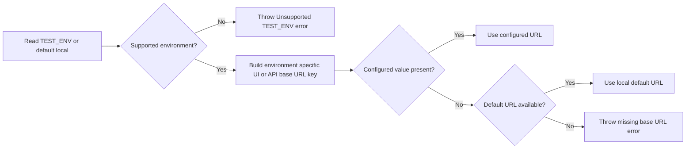

# Testing Workflows

This file documents the current automated testing workflows configured in this repository.

## End-to-end Framework Test Workflow



## Test Environment URL Resolution Workflow


```
